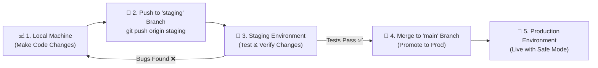

# Beginner's Guide: Staging to Production Pipeline

This guide is designed for beginners. It explains in plain English exactly how to make changes, push them to a **Staging** environment for testing, and then safely promote those changes to **Production**.

---

## 🗺️ Visual Overview



---

## 📑 The 3 Phases Explained Simply

| Phase | Where it happens | What you do | Goal |
| :--- | :--- | :--- | :--- |
| **Phase 1: Local Development** | Your Laptop / PC | Write or edit code, verify it works locally. | Prepare your update. |
| **Phase 2: Staging** | Staging Server (`:5174`) | Run automated tests against staging web apps. | Catch bugs before users see them. |
| **Phase 3: Production** | Production Server (`:5173`) | Deploy with PostgreSQL & Safe Mode enabled. | Live, secure release. |

---

## 🛠️ Step-by-Step Instructions

### Phase 1: Work on the `staging` Branch Locally

Whenever you make any change or update, **never push directly to `main`**. Always work on `staging`.

#### 1. Open Terminal in your project:
```powershell
cd C:\Users\sunil\.gemini\antigravity\scratch\ai-qa-agent
```

#### 2. Switch to (or create) the `staging` branch:
```powershell
# Create staging branch if it doesn't exist yet
git checkout -b staging

# If you already have staging, just switch to it:
git checkout staging
```

#### 3. Save your changes and push to Staging on GitHub:
```powershell
git add .
git commit -m "Update: description of changes made"
git push -u origin staging
```

> [!NOTE]
> Your changes are now stored on the `staging` branch on GitHub. Your `main` (Production) branch is untouched and safe.

---

### Phase 2: Deploy and Test on Staging

Now, deploy your changes to the Staging server to test them.

#### 1. On your Server, switch to the `staging` branch:
```bash
git checkout staging
git pull origin staging
```

#### 2. Ensure Staging configuration is in place:
*(Only needed the very first time)*
```bash
cp .env.staging.example .env.staging
```

#### 3. Start the Staging container:
```bash
docker compose -f docker-compose.staging.yml up --build -d
```

#### 4. Test everything:
1. Open your browser to **`http://<SERVER_IP>:5174`** (Staging Dashboard).
2. Enter your staging target URL (e.g. `https://dev-app.webnyay.in/login`).
3. Click **"Start AI Test"**.
4. Check that:
   - The test run completes without crashes.
   - Screenshots and execution logs are captured.
   - Bug reports are generated accurately.

> [!TIP]
> If you find a bug on Staging: fix it on your local machine, commit, push to `staging`, and re-test. **Do not move to Phase 3 until Staging passes 100%.**

---

### Phase 3: Promote from Staging to Production

Once your tests pass on Staging, it is time to move the verified code to Production.

#### Method A: Via GitHub Website (Recommended & Safest)
1. Go to your repository on GitHub: **[github.com/sunilgc2004/agentic](https://github.com/sunilgc2004/agentic)**.
2. Click **"Pull requests"** ➔ **"New pull request"**.
3. Set **Base: `main`** ➔ **Compare: `staging`**.
4. Click **"Create pull request"**, review your changes, and click **"Merge pull request"**.

*(Now your changes are officially in the production `main` branch!)*

---

#### Method B: Via Terminal (Fast alternative)
If you prefer terminal commands on your local PC:
```powershell
# Switch to main branch
git checkout main

# Merge the approved changes from staging into main
git merge staging

# Push to production on GitHub
git push origin main
```

---

### Phase 4: Deploying Live Production

On your production server (or live environment):

#### 1. Pull the newly merged `main` branch:
```bash
git checkout main
git pull origin main
```

#### 2. Ensure Production configuration is in place:
*(Only needed the very first time)*
```bash
cp .env.prod.example .env.prod
```

#### 3. Start the Production container:
```bash
docker compose -f docker-compose.prod.yml up --build -d
```

#### 4. Verify Production:
- Open **`http://<SERVER_IP>:5173`** (Production Dashboard).
- The platform is now running with:
  - Enterprise **PostgreSQL 16** database.
  - **Strict Production Safe Mode** (automatically blocks destructive actions like delete or purchase unless human approved).
  - Masked credentials and secure reporting.

---

## ⚡ Daily Command Cheat Sheet

| I want to... | Command to run |
| :--- | :--- |
| **Start working on Staging** | `git checkout staging` |
| **Save & Push to Staging** | `git add .` <br> `git commit -m "My update"` <br> `git push origin staging` |
| **Launch Staging Server** | `docker compose -f docker-compose.staging.yml up --build -d` |
| **Merge Staging to Production** | `git checkout main` <br> `git merge staging` <br> `git push origin main` |
| **Launch Production Server** | `docker compose -f docker-compose.prod.yml up --build -d` |
| **Check Production Logs** | `docker compose -f docker-compose.prod.yml logs -f` |
| **Stop Production** | `docker compose -f docker-compose.prod.yml down` |
